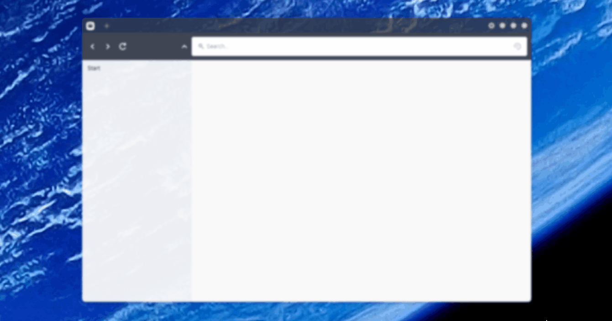

# Pilgrim



Made in electron.

## How to use
Clone this repo, install dependencies, and run it!
```shell
# Clone
git clone https://github.com/maanlamp/filebrowser.git;

# Install deps
npm i;

# Run it!
electron "<PATH TO THE REPO>";
```
